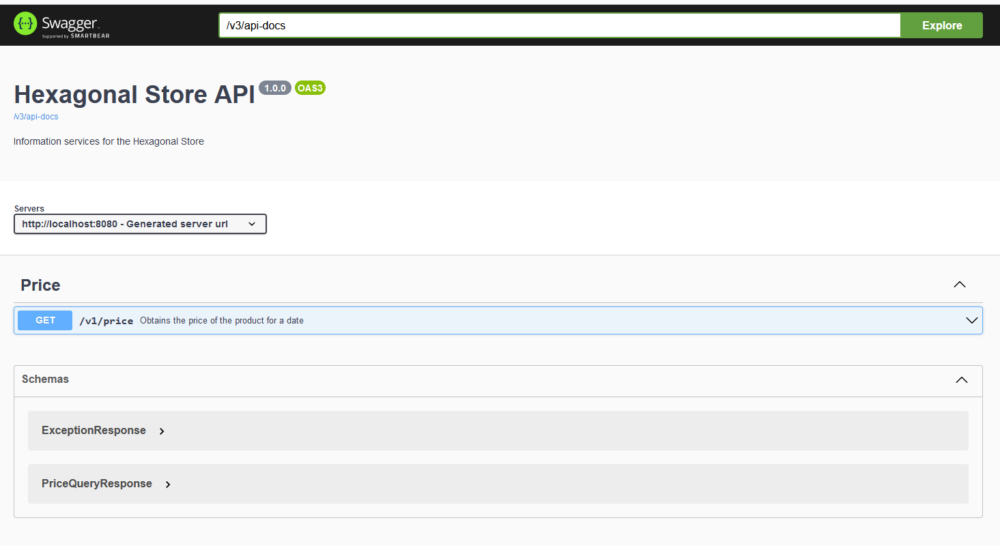

# Hexagonal architecture - Application for rate / price management of a store

This application is an example of a store price / rate management system that follows the hexagonal architecture. The application allows to query the rate / price to be applied to a product on a given date through an API.

## Build and test with Maven
````
mvn clean test
````

## Run with Maven
````
mvn spring-boot:run
````

## API Routes

1.	Consult the price/rate of a product for a certain date.

	Method: POST
	Path: /v1/price/search
	Input: JSON with the information that composes the filter (date, productId and brandId)

````
{
    "date": "2020-06-14T10:00:00.000+0200",
    "productId": 35455,
    "brandId": 1
}
````

## API Documentation
You can access the API documentation locally at the following URL:

[http://localhost:8080/swagger-ui/index.html](http://localhost:8080/swagger-ui/index.html)



## Postman Collection
The [Hexagonal-Store.postman_collection.json](Hexagonal-Store.postman_collection.json) file contains a Postman Collection that allows the following requests to be made:

1. 	**Test 1:** request at 10:00 on the 14th of the day for product 35455 for brand 1 (ZARA).
2. 	**Test 2:** request at 16:00 on the 14th of the day of the product 35455 for brand 1 (ZARA).
3. 	**Test 3:** request at 21:00 of the 14th of the day of the product 35455 for the brand 1 (ZARA).
4. 	**Test 4:** request at 10:00 on the 15th of the day of the product 35455 for brand 1 (ZARA).
5. 	**Test 5:** request at 21:00 of the day 16 of product 35455 for brand 1 (ZARA)

## Contract-First REST API design
This application has been designed without following a contract-first REST API design. However, an example of how to generate the API interface from the swagger specification is included. 

Run with Maven:

````
mvn generate-sources
````

## TODO
Possible actions for improvement are listed below:

*	Securize the API
*	Use of enumerated in the API, e.g. for allowed brands.
*	Create FK, e.g. with brands.
*	Refactor the project so that instead of being a maven project it is a project with three modules (application, domain, infrastructure).
*	Using Contract-First REST API design.

